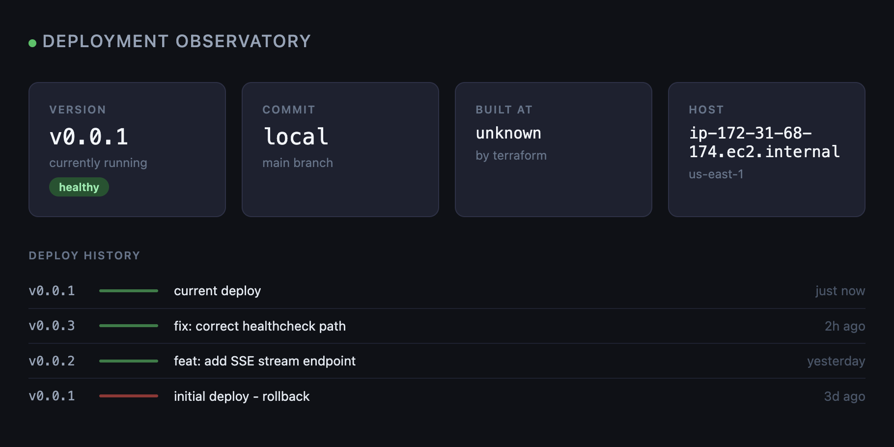
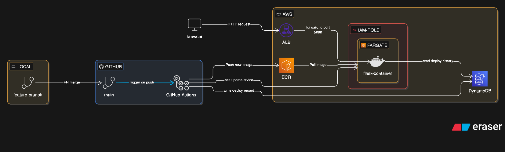

# Deployment Observatory

A live CI/CD dashboard that lets anyone watch a real deployment happen in the browser, as it happens. Push a commit, and the pipeline stages tick green in real time. The version number on the page flips the moment the new container comes up.

I don't leave it running to avoid unnecessary costs. The entire infrastructure is written in Terraform so I can spin it up in under 3 minutes on demand.

## Purpose

This dashboard answers the question "what is running in production right now and who put it there?" in one place, live, without anyone having to look anything up.

I am planning to expand this to be multiple modules all showing the live version of any application I run live in the future.

## Architecture

## Tech stack

| Layer          | Tool              | Why                                                         |
| -------------- | ----------------- | ----------------------------------------------------------- |
| App            | Python + Flask    | Lightweight, easy to containerize, clean SSE support        |
| Container      | Docker            | Reproducible builds, identical behaviour locally and on AWS |
| Registry       | AWS ECR           | Private Docker image storage, native ECS integration        |
| Compute        | AWS ECS Fargate   | Serverless containers, no EC2 instances to manage           |
| Load balancer  | AWS ALB           | Health checks, routes traffic, public entry point           |
| Database       | AWS DynamoDB      | Serverless, zero config, perfect for a deploy log           |
| Infrastructure | Terraform         | All infra as code, version controlled, reproducible         |
| CI/CD          | GitHub Actions    | Triggers on push to main, builds and deploys automatically  |
| State backend  | AWS S3 + DynamoDB | Remote Terraform state with locking                         |
